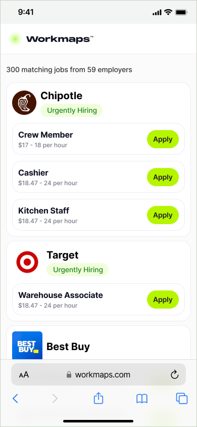

# Workmaps Takehome Solution Template

Welcome to the Workmaps Candidate Assessment, this repository serves as a bassis for our technical assessments involving our NextJS / Tailwind feature platform.

## What are we building?

You're being tasked with building a proof-of-concept for the job feed to demo the feed-data that is being written to the `jobs` schema inside of a postgres database.  An initial mobile designs has been handed off by the designer and the goal is to build a simple version that renders all the jobs currently in the database so we can show potential investors a prototype of the UI.  _We've provided a small sampling of jobs that would emulate a feed that refreshes daily and are not requiring any geo-graphic fencing in this proof-of-concept_.


## Expectations

The expectation is that this solution template provides a repository with a foundation for the candidate to show us some implement skills and the ability to _show their work_.  Nothing in this assessment should be considered __difficult__ or __gotchas__.  Please keep your solution to the 45-90 minute time-threshold as that is the shared intention.



### Deliverable

1. We expect the __Job Feed__ (see [design](https://www.figma.com/file/yRVkiNHfm6c00RT3HLOyiv/FrontEnd-UI---Mobile?type=design&node-id=8%3A108&mode=dev&t=LSEeN6Z6QOZ224OS-1)) to be implemented in `page.tsx` by using and modifying the basic stub for endpoint `GET /api/jobs`. We've provided a fixture of jobs that can be loaded, in this proof-of-concept, we __do not__ want to show jobs that are `verified:false` see the `prisma/schema` to see the columns.

2. UI/UX consideration, the designer was in a rush and only gave us a mobile version the desktop version should be constrained and be workable

3. The Apply Button should be a click to `/click-out/{job.id}` which emulates our click-out tracking strategy, but locally just shows `json` for the click-out.

4. The github-action / CI should pass for your solution and write an updated test for the endpoint.

5. __Stretch:__ We ask also that you help our founders for their up-coming demo to write some `sql` that they can run prior to analyze the total revenue potential for the current job inventory broken down by `cpc` and `cpa`.  Provide this documentation on the __Pull-Request__.

### Grading Rubric

We want to ensure you submit a successful solution so here is our assessment grading rubric.

|  | Task / Skill-Check   | Description                                                                         |
|---|-------------------|-------------------------------------------------------------------------------------|
| :thumbsup: | Code Complete        | Did you complete the assessment in it's entirety in terms of functionality          |
| :satellite: | API / Network Comms. | Were networking communications properly configured and handled                                 |
| :thought_balloon: | Pull-Request         | Open up a proper PR, **_read the submission process below_**                            |
| :shipit: | Commit History       | We value [conventional-commits](https://www.conventionalcommits.org/en/v1.0.0)      |

## Solution Template Getting Started

### Repository Contents

- Generated a NextJS 14 App with TailwindCSS, original `readme` documentation can be found inside of the [docs/nextjs-original-readme.md](./docs/nextjs-original-readme.md) 
- Instructions for running a Postgres container via `docker` -- [docs/run-docker-postgres-local.md](./docs/run-docker-postgres-local.md)
- Added `github-action` to run `npm tests` and the `npm run build`
- We give you a `components/` folder that has the `<Logo />` component to get your started
- We provide the __Apply Button__ click out functionality see `app/api/click-out/[...jobID]`
- We provide `fixtures/` with a sample/mock job-feed inside of the job-feed are the employer-logos from our __CloudFlare__


### Requirements

- You need nodejs `20.x` or greater
- You can run a version of Postgres (15.x) locally (`docker` preferably) but open to alternatives
- You have a registered Github Account


### Installation

```shell
npm install
```

### Setup App Runtime

> As mentioned have a functioning `Postgres` engine locally

```bash
# Create Postgres database to match the `.env` -- you can change this but we provide `docker`
createdb -h localhost -U candidate workmaps-tha-db

# setup Prisma Client and run migrations
npx prisma migrate deploy

# Load the fixtures we give you
npm run load-fixtures

# Run the local Dev / Nextjs
npm run dev
```

Open [http://localhost:3000](http://localhost:3000) with your browser to see the initial root page and or browser to [http://localhost/api/jobs](http://localhost:3000/api/jobs) to see the current endpoint stub.


### Test

```shell
npm run test
```

---

## Submitting a Solution

### 1. Setting Up Your Solution

> __IMPORTANT:__ When you receive this zip file create your repository and __COMMIT__ the code as the `feat: initial commit` inside of the _default branch_ `main` or `master`.

### 2. Create a Branch & PR

You should begin to build your solution on a new branch (_we don't care what you call it we recommend_ --  `solution`).  Once you are code complete, create a private repository and push up both branches.  And open up a pull-request against the _default branch_ `main|master`.

### 3. Finalize & Submit

Invite `mgan59`, `eligundry`, `zeen` to your repository so we can see your pull-request.

### 4. Review Process

Once the reviewers are added to the repository, we will conduct a quick PR review and contact you about next steps.